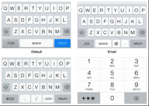

# **Keyboard**
Режимы ввода: 
Можно определить несколько разных типов 
ввода на клавиатуре. Обычно определяется в UITextField или UITextView. Доступ к самой клавиатуре не нужен.  

Отслеживание событий отображения\скрытия клавиатуры происходят в NotificationCenter. 

- **UIKeyboardWillShowNotification** Клавиатура будет отображена. 
- **UIKeyboardDidShowNotification** Клавитура была отображена.
- **UIKeyboardWillHideNotification** Клавиатура будет скрыта.
- **UIKeyboardDidHideNotification** Клавиатура была скрыта. 

## Keyboard overlaps content

Если клавиатура перекрывает контент, есть несколько способов разрешить эту проблему: 

- Поместить весь контент на ScrollView и менять inset для scrollView, и использовать -scrollToVisible:animated: что бы подтянуть контент. 
- Используя констрэинты подтянуть контент к верху. 

