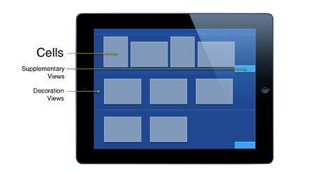
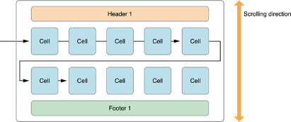
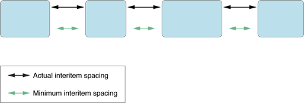
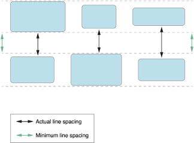

# UICollectionView
UICollectionView используется для отображения каких-либо данных, как и UITableView. Однако отличии от UITableView вы можете расположить ячейки как угодно благодаря гибкой системе расположения элементов. Обычно UICollectionView представляет собой некую таблицу, где элементы располагаются в несколько столбцов или строк. Примерами использования являются стандартные приложения Photos или AppStore. 
Основные преимущества UICollectionView:
- Практически безграничная кастомизация интерфейса. 
- Хорошая производительность и оптимизация для работы с большими данными. 


## UICollectionView elements
В отличии от знакомого нам UITableView, UICollectionView не содержит header и footer. Вместо него используется Supplementary Views. 

- Cells — это наши элементы для отображения
- Supplementary Views — это произвольное представление, наследуемое от UICollectionReusableView, которое может располагаться, где угодно. В том числе под секцией, над секцией, размерами и координатами управляет UICollectionViewLayout. 
- Decoration Views - представление, благодаря которому можно размещать наши cells на каком-то фоне. 





## Key UICollectionView Concepts
- Data source - предоставляет контент для UICollectionView который включает в себя 
	- Количество секций (numberOfSectionsInCollectionView:). В этом методе необходимо вернуть количество секций
	- Количество элементов в секции (collectionView:numberOfItemsInSection:). В этом методе необходимо вернуть количество элементом в определенной секции. 
	- Возвращает ячейку для настройки ее отображения (collectionView:cellForItemAtIndexPath:). В этом методе UICollectionView спрашивает у DataSource саму ячейку, в которой будет показан необходимый контент. 
- Delegate
- Layout

* * *
## Cell and View Reuse
Подобно UITableView, в UICollectionView используется механизм переиспользования ячеек и SupplimentaryView без их дополнительной аллокации. Представим, что у нас есть набор данных, который в данный момент отображен на экране, и есть какие-то ячейки для этих данных. Когда эти ячейки уходят с экрана, они не деинициализируются, а попадают в т.н. “очередь переиспользования” (Reuse queue). Когда UICollectionView потребуется снова получить объект этого элемента, она не создает его заново, а берет уже проинициализированный из очереди. Этот механизм позволяет UICollectionView работать с большим количеством данных, при этом оперируя небольшим количеством ячеек. Чтобы все работало правильно, необходимо проделать несколько действий:
Зарегистрировать ячейку и идентификатором: 
```objc
- (void)registerClass:forCellWithReuseIdentifier:
- (void)registerNib:forCellWithReuseIdentifier:

- (void)registerClass:forSupplementaryViewOfKind:withReuseIdentifier:
- (void)registerNib:forSupplementaryViewOfKind:withReuseIdentifier:
```

В DataSource методе cellForItemAtIndexPath: вы не должны создавать новую ячейку, а небходимо взять ее из очереди. Делается это с помощью следующих методов: 
```objc
- (UICollectionViewCell *)dequeueReusableCellWithReuseIdentifier:forIndexPath:
- (UICollectionReusableView *)dequeueReusableSupplementaryViewOfKind:withReuseIdentifier:forIndexPath:
```
Данные методы вернут ячейку из очереди если она там есть, а если в очереди ее нет, то создаст за вас новый объект. 

```objc
[self.collectionView registerClass:MyCustomCollectionViewCell.class
            forCellWithReuseIdentifier:@"MyCustomCollectionViewCell"];
```

и берем нашу ячейку из очереди:
```objc
- (UICollectionViewCell *)collectionView:(UICollectionView *)collectionView
                  cellForItemAtIndexPath:(NSIndexPath *)indexPath {
    MyCustomCollectionViewCell *cell = [collectionView
                                  dequeueReusableCellWithReuseIdentifier:@"MyCollectionViewCellIdentifier"
                                  forIndexPath:indexPath]; // Configure the cell’s content
    return cell;
}
```

## Supplementary Views Reuse
Анологичным образом и для supplementary view. Регистрируем ячейку:
 ```objc
[self.collectionView registerClass:MyHeaderSupplementaryView.class
            forSupplementaryViewOfKind:UICollectionElementKindSectionHeader,
            withReuseIdentifier:@"MyHeaderViewIdentifier"];
```

и берем нашу ячейку из очереди:
```
- (UICollectionReusableView *)collectionView:(UICollectionView *)collectionView
           viewForSupplementaryElementOfKind:(NSString *)kind
                                 atIndexPath:(NSIndexPath *)indexPath {
    MyHeaderSupplementaryView *view = [collectionView 
dequeueReusableSupplementaryViewOfKind:UICollectionElementKindSectionHeader
                                          withReuseIdentifier:@"MyCollectionViewCellIdentifier"
                                                    forIndexPath:indexPath];
    // Configure the view
    return view;
}
```
Однако, как можно заметить, для метода supplementary view есть параметр OfKind. Это тип, и каждый тип представлен произвольной строкой. Туда можно добавить любую строку для того, чтобы идентифицировать типы ваших supplementary view. В стандартном SDK преопределены два типа, это **UICollectionElementKindSectionHeader** и **UICollectionElementKindSectionFooter**.


* * *

## UICollectionViewDelegate
Основное назначение, для которого используется UICollectionViewDelegate: 
- Управление подсветкой (highlight)
- Управление выбора ячейки (selection)
- Поддержка действий меню на ячейках (actions menu) 


### Interacting with Content
У каждой ячейки есть свойство isSelected и isHighlighted 
Когда мы нажимаем по ячейке, первым вызывается метод делегата: 
- collectionView:shouldHighlightItemAtIndexPath:
В котором необходимо вернуть, нужно ли подсвечивать ячейку, когда пользователь на него нажимает. Если мы вернули YES, то следующим срабатывает метод: 
- collectionView:didHighlightItemAtIndexPath:
где мы можем поменять цвет если это необходимо. Следующим вызывается метод: 
- collectionView:shouldSelectItemAtIndexPath:
где мы должны вернуть, может ли ячейка быть выбрана. Если мы возвращаем YES, то ячейка становится выбранной и вызывается методы: 
- collectionView:didUnhighlightItemAtIndexPath:
- collectionView:didSelectItemAtIndexPath:
когда свойство ячейки isSelected переходит в YES, то свойство isHighlighted переходит в состояние NO и вызывается метод didSelectItemAtIndexPath. 
Если мы по выбранной ячейки нажмем еще раз, то вызовется метод: 
- collectionView:shouldDeselectItemAtIndexPath:
где мы должны вернуть, можно ли отменить выделение этой ячейки. Т.е. свойство isSelected установить в значение NO. Если мы возвращаем YES, то следом вызовется метод: 
- collectionView:didDeselectItemAtIndexPath:


## UICollectionViewCell
Базовый класс для ячейки в UICollectionView наследуется от UICollectionViewReusableCell. Некоторые нюансы по работе с UICollectionViewCell:
-	Не предоставляет никаких стилей. Поэтому в любом случае необходимо создать свой подкласс. 
-	Отслеживает события выделения и подсветки (selection and highlight)


* * *


## UICollectionViewLayout
Абстрактный базовый класс для создания правил позиционирования и размеров элементов в UICollectionView. UICollectionViewLayout вычисляет атрибуты позиционирования для: Ячеек(Cells), Supplementary views, Decoration views. Так как это абстрактный класс, для того чтобы начать им пользоваться, необходимо создать наследника этого класса. 
**UICollectionViewLayoutAttributes**
Атрибуты позиционирования включают в себя: 

- Position - расположение
- Size - размеры
- Opacity - прозрачность
- zIndex - позиция по оси Z. 
- Even transform 
- ...


## UICollectionViewFlowLayout
Чтобы облегчить жизнь UIKit имеет “стандартную” реализацию UICollectionViewLayout - UICollectionViewFlowLayout. Это уже рабочий сабкласс UICollectionViewLayout который позволяет вам быстро начать использовать UICollectionView. Некоторые свойства: 
-	Линейно ориентированный
-	Может быть организован как таблица, так и группа линий




#### Customization

- Item size - размер элемента
- Line spacing - отступы по линии  
- Inter cell spacing - отступы между ячейками
- Scrolling direction - ориентация и направление скроллинга
- Header and footer size
- Section Inset - отступы между элементами и секциями (header и footer)


Все эти свойства могут быть установлены как напрямую через свойства, так и используя UICollectionViewDelegateFlowLayout. Это делегат UICollectionViewFlowLayout, где можно определить методы, в которых можно возвращать конкретные значения. 
- Item size
Можно установить глобально, для всех элементов: 
```objc
@property (nonatomic) CGSize itemSize;
layout.itemSize = CGSizeMake(30, 20);
```
Если мы хотим, чтобы каждый элемент имел отличный размер, нам нужно реализовать метод делегата: 
`collectionView:layout:sizeForItemAtIndexPath:`
В котором мы возвращает размер для конкретной ячейки

- Minimum inter-item spacing
На самом деле мы устанавливаем только минимальное расстояние между ячейками, а сам FlowLayout исходя из содержимого сам считает реальное расстояние. Так как у нас элементы могут быть расположены, и иметь разные размеры, визуально некрасиво будет иметь статичное расстояние. 



- Minimum line spacing
Тот-же принцип применяется и к расстоянию между линиями. Мы задаем минимальное расстояние а FlowLayout подстраивает сам реальный размер. 

Расстояние между ячейками и линиями можно установить глобально через свойство: 
```objc
@property (nonatomic) CGFloat minimumLineSpacing;
@property (nonatomic) CGFloat minimumInteritemSpacing;
```
или рассчитывать для каждого элемента отдельно используя методы делегата 
```objc
- (CGFloat)collectionView:layout:minimumLineSpacingForSectionAtIndex:
- (CGFloat)collectionView:layout:minimumInteritemSpacingForSectionAtIndex:
```
- Scroll direction
FlowLayout позволяет менять ориентацию для скроллинга. 
`@property (nonatomic) UICollectionViewScrollDirection scrollDirection;`
Может иметь два значение: вертикальный - **UICollectionViewScrollDirectionVertical**, горизонтальный - **UICollectionViewScrollDirectionHorizontal**
- Headers and Footers
FlowLayout позволяет нам установить размеры header и footer. Значение высоты важно если у нас используется вертикальный скролл, а ширины в случае горизонтального скрола. 
Может быть установлен глобально: 
```objc
@property (nonatomic) CGSize headerReferenceSize;
@property (nonatomic) CGSize footerReferenceSize;
```
	или используя методы делегата для каждого элемента в отдельности:
```objc
- (CGSize)collectionView:layout:referenceSizeForHeaderInSection:
- (CGSize)collectionView:layout:referenceSizeForFooterInSection:
```

- Sections insets
FlowLayout позволяет менять отступы между элементами и секциями


Может быть установлен глобально:
```objc
@property (nonatomic) UIEdgeInsets sectionInset;
```
Так и для каждой секции отдельно используя метод делегата:
```objc
- (UIEdgeInsets)collectionView:layout:insetForSectionAtIndex:
```
* * *
## Custom Layout
Basics to override
Чтобы создать свой собственный UICollectionViewLayout, необходимо будет переопределить некоторые методы и свойства, такие как:
- **prepareLayout**
Метод, который будет вызывает перед тем, как UICollectionView будет обращаться к вашему UICollectionViewLayout для того, чтобы взять у него атрибуты. 
- **collectionViewContentSize**
Метод, который возвращает размер контента

- **layoutAttributesForElementsInRect**:
- **layoutAttributesForItemAtIndexPath**:
- **layoutAttributesForSupplementaryViewOfKind:atIndexPath:**
- **layoutAttributesForDecorationViewOfKind:atIndexPath:**

* * *
## Useful links 🤓
[Collection View Programming Guide for iOS](https://developer.apple.com/library/archive/documentation/WindowsViews/Conceptual/CollectionViewPGforIOS/Introduction/Introduction.html#//apple_ref/doc/uid/TP40012334-CH1-SW1)

[Creating custom layout](https://developer.apple.com/library/archive/documentation/WindowsViews/Conceptual/CollectionViewPGforIOS/CreatingCustomLayouts/CreatingCustomLayouts.html#//apple_ref/doc/uid/TP40012334-CH5-SW1)

