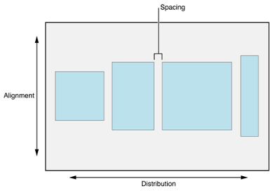
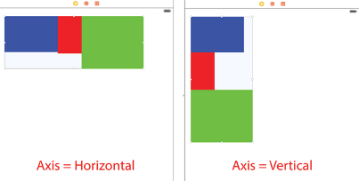
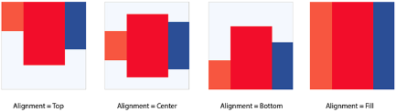
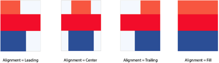
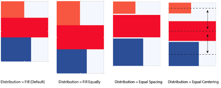
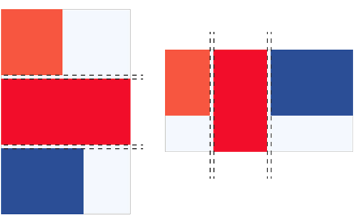

# **UIStackView**
UIStackView предоставляет удобный интерфейс для расположения дочерних элементов по горизонтали или вертикали. UIStackView позволяет использовать всю мощь autolayout без использования констрейнтов, позволяет создавать пользовательский интерфейс, который динамически реагирует на внешние и внутренние изменения. Для позиционирования UIStackView вам придется использовать свои констреинты, без них система может посчитать размер UIStackView на основе его элементов. Если ширина и высота указаны явно, то UIStackView будет регулировать размер и положение дочерних элементов для того, чтобы заполнить все заданное пространство. 




UIStackView опирается на intrinsic content size, приоритеты compression resistance и content hugging для того, чтобы знать какое пространство занимают элементы и то, как их можно сжимать. 
Для финального расчета размера и положения элементов в UIStackView зависит от его свойств, а также от того, будете ли вы добавлять свои констрейнты внутри самого UIStackView. Это возможно сделать, например можно добавить констрейнт высоты или ширины. Но лучше этим не увлекаться, так как сам UIStackView создает внутри себя множество констрейнтов и это может сказываться как на производительности, так и на том, что ваши констреинты могут конфликтовать с констрейнтами внутри UIStackView. 


* * *

## Attributes 
- **Axis** Определяет ориентацию UIStackView





- **Alignment**
Определяет расположение элементов перпендикулярно ориентации UIStackView. 

Горизонтальная ориентация:




Вертикальная ориентация:





- **Distribution**
Определяет расположение элементов в текущей ориентации. По умолчанию
	- Fill - заполняет все свободное прастранство на основе intrinsicContentSize и contentCompressionResistancePriority и contentHuggingPriority, чтобы определить какие элементы увеличивать или уменьшать.
	- Fill Equally - заполняет все свободное пространство чтобы каждый элемент был эквивалентен друг другу. 
	- Equal Spacing - заполняет все свободное пространство растягивая элементы по ширине или высоте 
	- Equal Centering - распределяет элементы так, чтобы между их центрами было равное расстояние




- **Spacing**
Определяет расстояние между соседними элементами в UIStackView. По умолчанию он равен 0. 





* * *

## Adding subviews

Дочерние элементы можно добавлять через Xib\Storyboard, а также нам доступно следующее API.
Все дочерние элементы лежат в следующем свойстве:
```
@property(nonatomic, readonly, copy) NSArray<__kindof UIView *> *arrangedSubviews;
```
В отличии от стандартного для UIView свойства subviews. subviews это просто добавленные дочерние элементы, и UIStackView не будет управлять их положение и размером. Чтобы позволить UIStackView управлять дочерними элементами, добавление должно происходить через следующие методы: 
```objc
- (void)addArrangedSubview:(UIView *)view;
- (void)insertArrangedSubview:(UIView *)view 
                      atIndex:(NSUInteger)stackIndex;
и удаление:
- (void)removeArrangedSubview:(UIView *)view;
```
Есть важный момент, когда мы удаляем элемент используя removeArrangedSubview:, элемент продолжает оставаться в массиве subviews, и он может продолжать показываться, но UIStackView прекращает управлять ее размером и положением. 
Используя это API, UIStackView автоматически обновляет layout отслеживая добавление\удаление а также свойство isHidden. А также следит за своми собственными атрибутами. Например если мы поменяем ориентацию, UIStackView автоматически перерисует свое представление. Все эти действия могут быть анимированы. 


