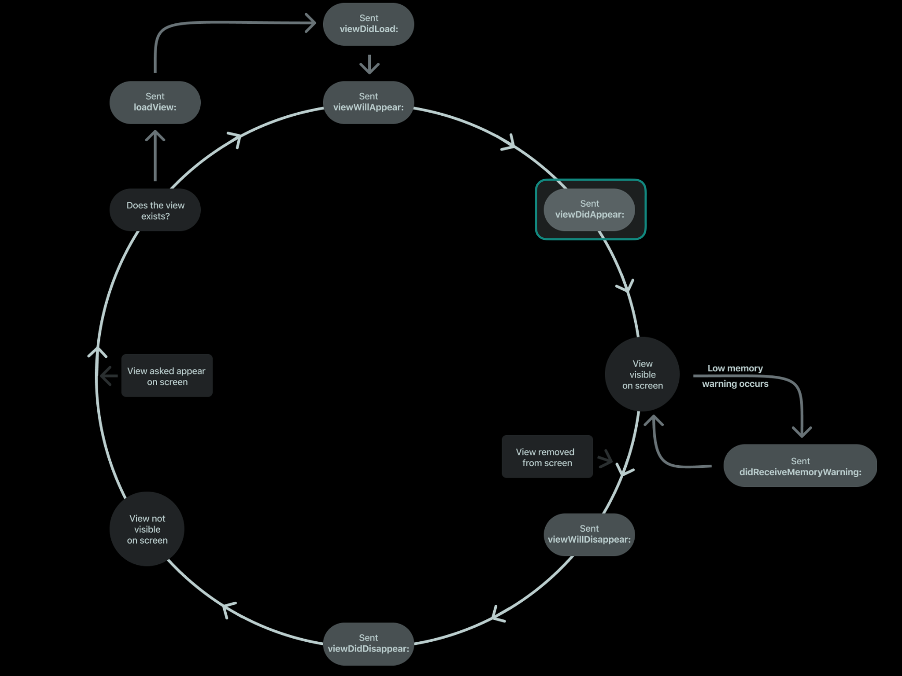

# ViewController

<!-- TOC -->
- [UIViewController](#uiviewcontroller)
- [Управление иерархией view:](#управление-иерархией-view)
- [Листинг с примером обработки пользовательских действий:](#листинг-с-примером-обработки-пользовательских-действий)
- [Lifecycle](#lifecycle)
- [Managing Memory Efficiently](#managing-memory-efficiently)
- [Handling View Rotations](#handling-view-rotations)
- [Custom Container VC](#custom-container-vc)
- [Процесс удаления дочерних контроллеров:](#процесс-удаления-дочерних-контроллеров)
- [Useful materials 🤓](#useful-materials-)
<!-- /TOC -->

**ViewController** - основа внутренней структуры iOS приложения. iOS приложение имеет как **минимум один** ViewController, который является рутовым контроллером окна(window). Однако, большинство приложений содержит большое количество контроллеров. Контроллер управляет частью пользовательского интерфейса, вместе с этим он управляет взаимодействием с этим интерфейсом и некими данными. Также контроллер обеспечивает перемещения между различными частями приложения. Так как контроллеры играют такую важную часть приложения, их можно назвать центром практически всего что вы делаете. 


## UIViewController
#### *Наследуется от **UIResponder***

Класс определяет методы и свойства для управления вашими View, обработке событий, переходами от одного контроллера к другому и координацией с другими частями приложения. Вы можете создать подкласс **UIViewController** или одного из его подклассов, и добавлять необходимый код для реализации поведения нашего приложения. 
Все контроллеры можно разделить на два типа: 
- **Content view controllers**
Управляет часть контента приложения и является главным типом контроллера, который вы создаете
- **Container view controllers**
Позволяет добавлять в себя дочерние контроллеры и собирает с них информацию включая навигацию между этими контроллерами. 

UIKit содержит готовые реализации контейнера контроллеров (Container view controllers), такие как: **UINavigationController**, **UITabBarController** и **UISplitViewController**. В приложении одновременно могут использоваться контроллеры обоих типов. 

---
**Схема MVC (model-view-controller):**


---
Контроллер является посредником между представлением (**View**) которым он управляет и данными приложения (**Model**). Реализуя тем самым паттерн **MVC** (model-view-controller). К модели мы относим данные, с которыми работает приложение, к view - их отображение, с которыми работает контроллер.
Методы и свойства UIViewController позволяют вам работать с визуальной частью приложения. Когда вы создаете подкласс UIViewController, вы создаете переменные и свойства, которые ссылаются на вашу модель. Через эти свойства вы можете управлять и взаимодействовать с данными. Необходимо четко разграничивать обязанности в MVC. Большая часть логики, обеспечивающей целостность и структуру данных, должна находиться в модели. Реализация модели должна быть закрыта за протоколом, в котором будут определены методы для взаимодействия с этой моделью (предоставление, обновление, изменения). Контроллер может проверять валидность данных, получаемых от view(например данные из текстового поля), после чего упаковать данные в необходимый для модели формат и отправить их в модель, а дальнейшую обработку модель проведет самостоятельно. Основная идея в том, что нужно **максимально минимизировать обязанности контроллера** по работе с данными. 

#### Управление иерархией view:


Наиболее важная роль контроллера — это управление **иерархией view**. Каждый контроллер имеет единственную рутовую view, которая охватывает весь контент контроллера. Именно на эту рутовую view вы добавляете дочерние view, которые необходимо показать. Контроллер всегда имеет ссылку на рутовую view и каждая view имеет сильные ссылки на дочерние view.  В зависимости от типа контроллера в отношении view используются подходы:
-	Content
Управляет всеми своими view самостоятельно
- Container view controllers
Управляет своими view, и в дополнении рутовыми view дочерних контроллеров. Контейнер не управляет контентом дочерних контроллеров. У дочерних контроллеров он управляет только размерами, положением в соответствии с заданными условиями. 
UIViewController является наследником UIResponder, поэтому способен обрабатывать события, приходящие по Responder Chain. Хотя они могут это делать, контроллеры редко обрабатывают события напрямую. Обычно view сами обрабатывает события и уведомляют о них свой контроллер. Таким образом, большинство событий в контроллере обрабатываются с использованием методов делегата или action метода.
UIViewController берет на себя всю ответственность за свои view и объекты, которые он создает. Как правило, большинство аспектов связанных с управлением view, UIViewController выполняет самостоятельно, например, UIKit автоматически освобождает ресурсы, связанные с view, которые больше не нужны. Когда доступная память заканчивается, у UIViewController вызывается метод didReciveMemoryWarning, где вы должны освободить любые ресурсы, которые больше не нужны. 
Контроллеры, ответственные за отображение view и их адаптацию под конкретные условия. Каждое iOS приложение должно быть способно запуститься и на iPad и iPhone, которые сейчас имеют разные размеры экранов. 
Существует три основных способа создание UIViewController:
1.	Xib - для определения в визуальной среде Interface Builder
2.	Storyboard - для определения в визуальной среде Interface Builder
3.	Code
InterfaceBuilder позволяет настраивать внешний вид, атрибуты, смотреть интерфейс без сборки приложения, смотреть, как UI будет себя вести на разных размерах экранов. Xib и Storyboard различают тем, что в Xib, как правило, помещается один UIViewController, тогда как в Storyboard определяется набор контроллеров, набор связей между ними и выстраивается иерархия. 

Использовать Xib и Storyboard можно для: 

1)	Добавления, упорядочения и настройки view. 
2)	Подключения IBOutlet и IBAction.
3)	Создания отношений и переходов между вашими контроллерами.
4)	Кастомизировать view для разных классов размеров (size classes).
5)	Добавления распознавания жестов.
*приставка IB - означает InterfaceBuilder

Storyboard удобен пока приложение небольшое, когда приложение имеет огромное количество контроллеров контролировать все в storyboard довольно таки сложно. В своем устройстве сториборд является XML файлом, и в случае если с ним одновременно работает несколько разработчиков, мерджить его - не самое приятное занятие. В меньшей мере это относится к Xib файлам, поэтому контроллеры можно полностью создавать в коде. 

### Листинг с примером обработки пользовательских действий: 
```objc
- (IBAction)myButtonAction:(id)sender {
     // Some action handling
}
// Add target-action for button
[button addTarget:self action:@selector(myButtonAction:) forControlEvents:UIControlEventTouchUpInside]; // ...
- (void)myButtonAction:(id)sender {
    // Some action handling
}
```

# Lifecycle
Жизненный цикл представляет собой набор методов, которые помогают нам знать, в каком состоянии находится ViewController.




Жизненный цикл начинается не с момента создания ViewController, а тогда, когда вы, или система впервые обратитесь к свойству view. Если значение свойства **view == nil**, тогда система автоматически запускает метод **-(void)loadView**. Для того чтобы проверить, загружена ли view, существует метод   **-(BOOL)isViewLoaded**, которая вернет текущее состояние и не запустит жизненный цикл ViewController. Никогда не нужно вызывать loadView: напрямую из кода, этот метод может вызывать только контроллер, если view == nil. Если view определена в nib файле, то loadView: загружает view из nib файла. Если для создания view вы использовали InterfaceBuilder, то не нужно переопределять метод loadView, его стоит переопределять только с целью создания view вручную. Если вы решили переопределить этот метод, то создание view и его присвоение ViewController лежит на вас, также не стоит вызывать имплементацию суперкласса. Если вы хотите просто провести дополнительную инициализацию ваших view, это стоит сделать в методе:

-  `- (void)viewDidLoad;` 
Метод viewDidLoad вызывается сразу после loadView:, когда ViewController загрузил свою иерархию view в памяти. Этот метод вызывается вне зависимости от того, была ли иерархия view загружена из nib файла или же была создана в loadView. При переопределении следует в начале вызвать его имплементацию в родительском классе [super viewDidLoad]. viewDidLoad вызывается единожды за всю жизнь ViewController. В этом методе рискованно работать с размерами, так как велика вероятность того, что они еще не сформированы окончательно. 
Далее при попытке показать ViewController на экране, вызывается метод:
- `- (void)viewWillAppear:(BOOL)animated;`
Который говорит ViewController о том, что его view скоро будет добавлена в иерархию и отображена на экране. Далее этот метод вызывается каждый раз перед тем, как контроллер будет показан. В момент вызова этого метода, рамеры уже есть, но ориентация еще не известна. Этот метод можно переопределить для выполнения настроек, связанных с отображением, например скрыть поля, перевести кнопку в состояние disable, применить новый стиль к статус бару и т.д Всегда следует вызывать имплементацию родительского класса: [super viewWillAppear]. 
Далее после того как контроллер показан на экране, вызывается метод: 

- `- (void)viewDidAppear:(BOOL)animated;`
Который говорит ViewController что view уже показана на экране. Данный метод вызывается каждый раз, когда контроллер показан на экране. Его можно переопределить, например для старта анимации, воспроизведения аудио, видео, обновления данных. Всегда следует вызывать имплементацию родительского класса: [super viewDidAppear]. 
- В момент, когда система заметила, что ваше приложение потребляет слишком много памяти, вызовется метод:
`- (void)didReceiveMemoryWarning;` 
В котором необходимо освободить столько памяти, сколько возможно, для продолжения работы приложения. Этот метод может быть вызван в любой момент жизненного цикла. 
В момент, когда наше приложение собирается открыть новый контроллер, будет вызван метод: 
- `- (void)viewWillDisappear:(BOOL)animated;`
Этот метод можно переопределить для сохранения каких-либо изменений, завершить редактирование и другие подобные действия. Всегда следует вызывать имплементацию родительского класса: [super viewWillDisappear].
- Далее вызывается метод: `- (void)viewDidDisappear:(BOOL)animated;` 
Говорящий контроллеру о том, что его view удалена из иерархии. Всегда следует вызывать имплементацию родительского класса: [super viewDidDisappear].
*Когда ViewController скрыт с экрана, это не значит, что он уже уничтожен. Если этот контроллер еще необходим, например, находится в стеке **UINavigationController**, то при последующем показе система не будет создавать view заново. Соответственно метод loadView: и viewDidLoad: будут пропущены, и сразу вызовется viewWillAppear:.* 
- При изменении размеров view, и необходимости пересчитать размер subviews вызываются методы: 
```
- (void)viewWillLayoutSubviews;
- (void)viewDidLayoutSubviews;
```
Впервые эти методы вызываются между вызовами методов viewWillAppear и viewDidAppear. Однако впоследствии могут вызываться при любом изменении размеров view. 

## Managing Memory Efficiently
У UIViewController есть список методов, где более предпочтительно выделять или освобождать память.  Освобождение проходит за счет удаления сильных ссылок. Чтобы удалить сильную ссылку нужно свойству или переменной присвоить nil (при ARC) или вызвать release (при MRC). Некоторые правила:
1)	Используйте инициализаторы для выделения памяти под структуры данных, 
2)	Используйте viewDidLoad для загрузки любых объектов данных, которые нужно отобразить. К вызову этого метода объекты гарантированно существуют и находятся в готовом состоянии. 
3)	Используйте метод didReceiveMemoryWarning для освобождения всех объектов, которые не являются критическими. Освободите столько памяти, сколько сможете. 
4)	Переопределяйте dealloc для освобождения свойств вашего контроллера и любых других данных при MRC, при ARC свойства освобождаются автоматически, поэтому явно этого делать не нужно. 
## Handling View Rotations
До iOS 8 у нас был следующий список методов для отслеживания ротации:
-	willRotateToInterfaceOrientation:duration:
-	willAnimateRotationToInterfaceOrientation:duration:
-	didRotateFromInterfaceOrientation:
Сейчас все они признаны [deprecated]. Начиная с iOS8 на замену пришел **viewWillTransitionToSize:withTransitionCoordinator:**. Когда меняется ориентация, UIKit вызывает этот метод у рутового контроллера, который в свою очередь уведомляет все дочерние view контроллеры и у них вызывается этот же метод. 

* * *
## Custom Container VC
Для создания кастомного контейнера необходимо установить отношения между вашим контроллером и дочерними контроллерами. Отношение родитель-наследник должно быть установлено перед тем, как вы попытаетесь управлять дочерним контроллером. Это необходимо чтобы дать знать UIKit, что ваш контейнер контроллер управляет размером и позицией дочерних контроллеров. Такое отношение можно создать как программно, так и в Interface Builder. Если отношения делаются программно, необходимо явно, кодом указать на такие отношения. Процесс добавления дочерних контроллеров: 

1)	Вызвать addChildViewController: в вашем контейнере. 
Вызов этого метода говорит UIKit что ваш контейнер-контроллер сейчас управляет размером и положением вашего ViewController. 
2)	Добавить корневой view дочернего контроллера в иерархию view контейнер-контроллера. 
3)	Добавить ограничения по размерам и позиционированию для дочерних view(constraints). 
4)	Вызвать метод didMoveToParentViewController: у дочерних view контроллеров. 
*Листинг добавления дочернего ViewController:* 

```objc
[self addChildViewController:childVC];
childVC.view.frame = [self frameForContentController];
[self.view addSubview:childVC.view];
[childVC didMoveToParentViewController:self];
```

Стоит обратить внимание, что явно здесь вызывается только didMoveToParentViewController: но мы не вызываем willMoveToParentViewController:. Это связано с тем, что addChildViewController: вызывает его автоматически. 

### Процесс удаления дочерних контроллеров:

1)	Вызвать у дочерних контроллеров метод willMoveToParentViewController: со значением nil
2)	Удалить все правила и ограничения по размерам, которые связывают контейнер и дочерние элементы. 
3)	Удалить корневое view дочернего контроллера из иерархии представлений у контейнер контроллера. 
4)	Вызываем у дочернего контроллера метод removeFromParentViewController: чтобы разорвать отношение родитель-потомок 

*Листинг удаления дочернего ViewController:*

```objc
[childVC willMoveToParentViewController:nil]; 
[childVC.view removeFromSuperview];
[childVC removeFromParentViewController];
```
Заметьте, в процессе удаления дочернего ViewController мы явно вызываем метод  willMoveToParentViewController: и не вызываем метод didMoveToParentViewController. Это связано с тем, что didMoveToParentViewController вызывается внутри реализации removeFromParentViewController.


* * *
## Useful materials 🤓

[UIViewController Documentation](https://developer.apple.com/documentation/uikit/uiviewcontroller?language=objc)

[View Controller Programming Guide for iOS](https://developer.apple.com/library/archive/featuredarticles/ViewControllerPGforiPhoneOS/index.html)


